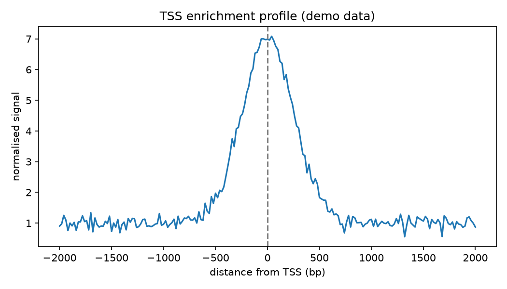

# Tss Enrichment Profile

Before you trust a single ATAC-seq peak, one plot tells you if the whole experiment worked: does accessibility spike right at gene starts? If it doesn't, your library is junk.

## Why This Matters

Open chromatin should concentrate at transcription start sites, so a metagene profile of signal around all TSSs should show a sharp central peak. A high TSS enrichment score means a clean library; a flat profile means degraded or failed chromatin, and no amount of downstream analysis will rescue it. It is the field's go/no-go QC.

## How It Works

1. Align the signal around every gene's TSS.
2. Average across all genes into a metagene profile.
3. A sharp central peak means good signal-to-noise.

## What the Demo Shows



The demo builds a profile with a strong peak at position zero. That sharp central spike is the healthy pattern — the check that tells you the experiment captured real open chromatin before you look at any individual region.

## Run It

```bash
pip install -r requirements.txt
python demo.py
```

> Demonstrated on synthetic data, so it's fully reproducible with no external downloads.
